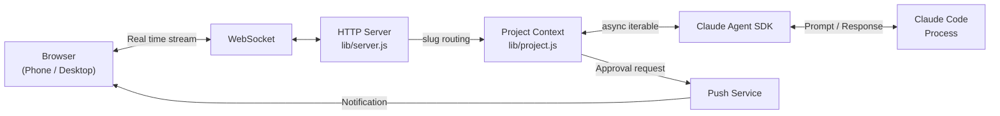

# Clay

<!-- HERO IMAGE: media/hero.png (새로 촬영)
     데모 환경: Kiln (가상 SaaS 스타트업)
     유저: Alex (Founder/Engineer), Sora (Designer)
     Mate: Rumi (코드 리뷰어), Nova (마케터)
     프로젝트: kiln-app

     촬영 가이드:
     - 정적 스크린샷, GIF 아님. 1400x900, 다크 테마.
     - 왼쪽 아이콘 스트립: kiln-app 프로젝트 활성 상태
     - 사이드바: Rumi, Nova Mate 아바타 + Sora 유저 + 세션 리스트
     - 메인 영역: Alex가 kiln-app에서 작업 중, Claude가 코드 블록과 함께 답변
     - 상단: "2 online" 프레즌스 뱃지 (Alex + Sora)
     - 목적: "터미널이 아닌 앱", "혼자가 아닌 팀", "여러 프로젝트 동시" 세 가지를 한 장에
     - 촬영 후 이 주석 삭제하고 아래 img 태그 활성화
-->
<p align="center">
  
</p>

<h3 align="center">Claude Code for your whole team. No team? Build one.</h3>

[](https://www.npmjs.com/package/clay-server) [](https://www.npmjs.com/package/clay-server) [](https://github.com/chadbyte/clay) [](https://github.com/chadbyte/clay/blob/main/LICENSE)

Claude Code is powerful, but it's one person in one terminal. Clay turns it into a shared workspace where your whole team works together, from any browser. Developers, designers, PMs. Your server, your rules.

```bash
npx clay-server
# Scan the QR code to connect from any device
```

---

## What you get

### One workspace for everything

All your projects, sessions, and teammates in a single browser UI. Add a project and an agent attaches to it. Run backend, frontend, and docs simultaneously. Switch between them in the sidebar.

The server runs as a background daemon. Sessions persist through crashes, restarts, and network drops.

<!-- MULTI-PROJECT GIF: media/split.gif (기존 에셋 유지)
     현재 split.gif가 이 역할을 잘 하고 있음. 교체 불필요.
-->
<p align="center">
  
</p>

### Bring your whole team

Invite teammates with their own accounts. Set permissions per person, per project, per session. A designer reports a bug in plain language. A junior dev works with guardrails. If someone gets stuck, jump into their session to help in real time.

Add a CLAUDE.md and the AI operates within those rules: explains technical terms simply, escalates risky operations to seniors, summarizes changes in plain words.

Real-time presence shows who's where.

<!-- TEAM GIF: media/team.gif (새로 촬영)
     데모 환경: Kiln

     촬영 가이드 (20초):
     1. Alex가 kiln-app 세션에서 작업 중 (프레즌스 "1 online")
     2. Sora가 접속 → 프레즌스 "2 online"으로 바뀌는 순간
     3. Sora가 같은 세션에서 Claude에게 "이 버튼 색 바꿔줘" 프롬프트 입력
     - 핵심: "혼자 쓰다가 팀원이 합류하는" 순간의 임팩트
     - 주의: 유저 간 직접 채팅 아님. 각자 Claude에 프롬프트 입력 또는 @멘션
     - 촬영 후 이 주석 삭제하고 아래 img 태그 활성화
-->
<p align="center">
  
</p>

### Build your team with Mates

Mates are AI teammates you create through conversation. Give them a name, avatar, expertise, and working style. A code reviewer who knows your architecture. A marketing lead who tracks your positioning. A writing partner who matches your voice.

They live in your sidebar next to your human teammates. DM them, @mention them in any project session, or bring multiple into the same conversation. Each Mate builds persistent knowledge over time, remembering past decisions, project context, and how you work together.

#### Debate before you decide

Let your Mates challenge each other. Set up a debate. Pick a moderator and panelists, give them a topic, and let them go. You can raise your hand to interject. When it wraps up, you get opposing perspectives from every angle.

"Should we rewrite this in Rust?" "Should we delay the launch to fix onboarding?" "Launch now or wait for v2?" Get real opposing perspectives before you commit.

<!-- MATES GIF: media/mates.gif (새로 촬영)
     데모 환경: Kiln

     촬영 가이드 (25초):
     1. 사이드바에 Rumi, Nova Mate + Sora 유저가 보이는 상태
     2. 채팅에서 @Rumi 멘션 입력 → Rumi가 코드 리뷰 응답
     3. Debate 시작 → Rumi(모더레이터)가 Nova를 @멘션으로 호출
     4. 2-3턴 오가는 토론 장면
     - 핵심: "AI 팀원이 서로 토론한다"는 임팩트
     - Mate 아바타가 선명하게 보여야 함
     - 촬영 후 이 주석 삭제하고 아래 img 태그 활성화
-->
<p align="center">
  
</p>

### Runs as a service

Clay runs as a daemon on your server. Close your laptop, log out, go to sleep. Sessions keep running.

Schedule tasks with cron. Set up autonomous coding loops with Ralph Loop: define a task (`PROMPT.md`) and success criteria (`JUDGE.md`), and the agent iterates until the judge says PASS. Based on [Geoffrey Huntley's Ralph Wiggum technique](https://ghuntley.com/loop/).

Your phone buzzes when Claude needs approval, finishes a task, or hits an error. Install as a PWA for native-like push notifications.

<!-- RUNS AS SERVICE: 두 에셋 병렬 배치
     왼쪽: media/phone.gif (기존 에셋) - 폰에서 Clay 접속하는 모습
     오른쪽: media/push-notification.jpg (기존 에셋) - 푸시 알림
     데스크톱 hero에서 "이건 앱이구나" → 여기서 "폰에서도 되네" 1-2 펀치
-->
<p align="center">
  
  &nbsp;&nbsp;&nbsp;
  
</p>

---

## How a bug gets fixed

**Without Clay:**
Designer finds a bug → writes up a ticket on Asana → dev asks clarifying questions → PM prioritizes → dev opens terminal, fixes it → shares a preview → QA checks → deploy
<br>*7 steps. 3 people. 2 days.*

**With Clay:**
Designer opens Clay in the browser, describes the bug in plain language → senior joins the same session, reviews the fix together → merge
<br>*2 steps. 2 people. 10 minutes. The designer never touched a terminal.*

---

## How Clay compares

*As of March 2026.*

| | CLI | Remote Control | Channels | **Clay** |
|---|---|---|---|---|
| Multi-user with roles | – | – | Platform-dependent | **Accounts + RBAC** |
| AI teammates (Mates + Debates) | – | – | – | **Yes** |
| Join teammate's session | – | – | – | **Yes** |
| Persistent daemon | – | Session-based | – | **Yes** |
| Native mobile app | – | **Yes** | **Platform app** | PWA |
| Official support | **Anthropic** | **Anthropic** | **Anthropic** | Community |

Clay is a community project, not affiliated with Anthropic. Official tools receive guaranteed support and updates.

---

## Getting Started

**Requirements:** Node.js 20+, Claude Code CLI (authenticated).

```bash
npx clay-server
```

On first run, it walks you through port and PIN setup.
Scan the QR code to connect from your phone instantly.

For remote access, use a VPN like Tailscale.

<!-- START GIF: media/start.gif (기존 에셋 유지, 교체 고려)
     현재 start.gif는 터미널에서 실행하는 모습만 보여줌.
     더 강한 버전: npx clay-server → QR 코드 → 폰에서 스캔 → 브라우저 열림 (15초)
     "한 줄 치면 끝"이라는 걸 시각적으로 증명.
     기존 것으로도 충분하면 유지. 교체하려면 위 흐름으로 재촬영.
-->
<p align="center">
  
</p>

---

## Security & Privacy

Your data flows directly from your machine to the Anthropic API, exactly as it does when you use the CLI. Clay adds a browser layer on top, not a middleman.

HTTPS is enabled by default with a builtin certificate. PIN authentication and per-project/session permissions are built in. For local network use, this is sufficient. For remote access, we recommend a VPN like Tailscale.

---

## FAQ

**"Is this just a terminal wrapper?"**
No. Clay runs on the Claude Agent SDK. It doesn't wrap terminal output. It communicates directly with the agent through the SDK.

**"Does my code leave my machine?"**
The Clay server runs locally. Files stay local. Only Claude API calls go out, which is the same as using the CLI.

**"Can I continue a CLI session?"**
Yes. Pick up a CLI session in the browser, or continue a browser session in the CLI.

**"Does my existing CLAUDE.md work?"**
Yes. If your project has a CLAUDE.md, it works in Clay as-is.

**"Does each teammate need their own API key?"**
No. Teammates share the Claude Code session logged in on the server. If needed, you can configure per-project environment variables to use different API keys for billing isolation.

**"Does it work with MCP servers?"**
Yes. MCP configurations from the CLI carry over as-is.

**"What are Mates?"**
AI teammates you shape through conversation. Each Mate has a name, avatar, personality, knowledge base, and persistent memory. They remember past decisions and project context across sessions. @mention them in any conversation, DM them directly, or put them in a structured debate to stress-test ideas. They sit in your sidebar alongside your human teammates.

---

## HTTPS

HTTPS is enabled by default using a builtin wildcard certificate for `*.d.clay.studio`. No setup required. Available from `v2.17.0-beta.2`. Your browser connects to a URL like:

```
https://192-168-1-50.d.clay.studio:2633
```

The domain resolves to your local IP. All traffic stays on your network. See [clay-dns](clay-dns/) for details on how this works.

Push notifications require HTTPS, so they work out of the box with this setup. Install Clay as a PWA on your device to receive them.

<details>
<summary><strong>Alternative: local certificate with mkcert</strong></summary>

If you prefer to use a locally generated certificate (e.g. air-gapped environments where DNS is unavailable):

```bash
brew install mkcert
mkcert -install
npx clay-server --local-cert
```

This generates a self-signed certificate trusted by your machine. The setup wizard will guide you through installing the CA on other devices.

</details>

---

## CLI Options

```bash
npx clay-server              # Default (port 2633)
npx clay-server -p 8080      # Specify port
npx clay-server --yes        # Skip interactive prompts (use defaults)
npx clay-server -y --pin 123456
                              # Non-interactive + PIN (for scripts/CI)
npx clay-server --no-https   # Disable HTTPS
npx clay-server --local-cert # Use local certificate (mkcert) instead of builtin
npx clay-server --no-update  # Skip update check
npx clay-server --debug      # Enable debug panel
npx clay-server --add .      # Add current directory to running daemon
npx clay-server --add /path  # Add project by path
npx clay-server --remove .   # Remove project
npx clay-server --list       # List registered projects
npx clay-server --shutdown   # Stop running daemon
npx clay-server --dangerously-skip-permissions
                              # Bypass all permission prompts (requires PIN at setup)
npx clay-server --dev        # Dev mode (foreground, auto-restart on lib/ changes, port 2635)
```

---

## Architecture

Clay drives Claude Code execution through the [Claude Agent SDK](https://www.npmjs.com/package/@anthropic-ai/claude-agent-sdk) and streams it to the browser over WebSocket.



For detailed sequence diagrams, daemon architecture, and design decisions, see [docs/architecture.md](docs/architecture.md).

---

## Contributors

<a href="https://github.com/chadbyte/clay/graphs/contributors">
  
</a>

## Contributing

Bug fixes and typo corrections are welcome. For feature suggestions, please open an issue first:
[https://github.com/chadbyte/clay/issues](https://github.com/chadbyte/clay/issues)

If you're using Clay, let us know how in Discussions:
[https://github.com/chadbyte/clay/discussions](https://github.com/chadbyte/clay/discussions)

## Disclaimer

This is an independent project and is not affiliated with Anthropic. Claude is a trademark of Anthropic.

Clay is provided "as is" without warranty of any kind. Users are responsible for complying with the terms of service of underlying AI providers (e.g., Anthropic, OpenAI) and all applicable terms of any third-party services. Features such as multi-user mode are experimental and may involve sharing access to API-based services. Before enabling such features, review your provider's usage policies regarding account sharing, acceptable use, and any applicable rate limits or restrictions. The authors assume no liability for misuse or violations arising from the use of this software.

## License

MIT
