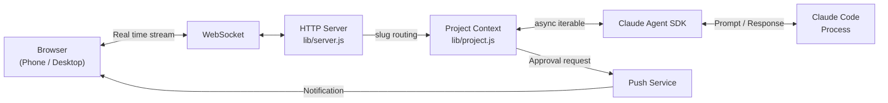

# Clay

<p align="center">
  
</p>

<h3 align="center">A multi-user web UI for Claude Code, built on the Agent SDK.</h3>

[](https://www.npmjs.com/package/clay-server) [](https://www.npmjs.com/package/clay-server) [](https://github.com/chadbyte/clay) [](https://github.com/chadbyte/clay/blob/main/LICENSE)

Clay extends Claude Code from a single-user CLI into a multi-user, multi-session web platform. It runs locally as a daemon, serves a browser UI over WebSocket, and lets non-technical teammates use Claude Code without touching the terminal.

No relay server in the cloud. Your machine is the server. Zero install — one command:

```bash
npx clay-server
# Scan the QR code to connect from any device
```

---

## Getting Started

**Requirements:** Node.js 20+, Claude Code CLI (authenticated).

```bash
npx clay-server
```

On first run, it walks you through port and PIN setup.
Scan the QR code to connect from your phone instantly.

For remote access, use a VPN like Tailscale.

<p align="center">
  
</p>

---

## Multi-session, multi-project

Add a project in the browser and an agent attaches to it.
Run backend, frontend, and docs simultaneously. Switch between them in the sidebar.

The server runs as a background daemon. Sessions persist even after you close the terminal.

Mermaid diagrams render as diagrams. Tables render as tables.
Code blocks highlight 180+ languages.
Browse project files in the file browser — changes reflect live while the agent works.

<p align="center">
  
</p>

---

## Multi-user

Invite teammates and give them access to a project. They talk to Claude Code directly in the browser — no terminal, no setup on their end.

Add a CLAUDE.md and the AI operates within those rules: explains technical terms in plain language, escalates risky operations to seniors, summarizes changes in simple words.

If someone gets stuck, join their session to unblock them in real time. Permissions can be separated per project and per session. Real-time presence shows who's where.

---

## Mobile & notifications

Phone, tablet, couch. All you need is a browser.
Pick up a terminal session in the browser. Continue a browser session from another device.
One QR code to connect. Install as a PWA for a native-like experience.

When Claude asks for approval, your phone buzzes. You also get notified on completion or error. No need to keep the browser open.

<p align="center">
  
</p>

---

## Automation

The scheduler kicks off agents at set times.
Have it check open issues and submit PRs every morning at 8 AM.
Or compile world news and email you a digest every day.

Take it further with Ralph Loop — autonomous iteration built into Clay. Define a task (`PROMPT.md`) and success criteria (`JUDGE.md`), then start the loop. The agent works, commits, and a judge evaluates the git diff as PASS or FAIL. On FAIL, a fresh session starts over. Each iteration has **no memory of previous conversations** — only the code carries over. Based on [Geoffrey Huntley's Ralph Wiggum technique](https://ghuntley.com/loop/).

---

## Security & Privacy

Clay turns your machine into the relay server. There is no intermediary server on the internet. No third-party service sits between your browser and your code.

The best relay server to trust is the one that doesn't exist. Clay has none. Your data flows directly from your machine to the Anthropic API — exactly as it does when you use the CLI. No one intercepts, collects, or reroutes it. Clay adds a browser layer on top, not a middleman.

PIN authentication, per-project/session permissions, and HTTPS are supported by default. For local network use, this is sufficient. For remote access, we recommend a VPN like Tailscale.

---

## Why Clay?

*As of March 2026.*

| | CLI + Remote Control | tmux | Desktop | Cowork | **Clay** |
|---|---|---|---|---|---|
| Multi-user | ❌ | ✅ | ❌ | ❌ | ✅ |
| Mobile / PWA | ✅ | ➖ | ➖ | ➖ | ✅ |
| Push notifications | 🟠 | ❌ | 🟠 | ❌ | ✅ |
| GUI | 🟠 | ❌ | ✅ | ✅ | ✅ |
| Scheduler (cron) | 🟠 | ❌ | ✅ | ✅ | ✅ |
| Scheduler survives logout | ❌ | ➖ | 🟠 | 🟠 | ✅ |
| Join teammate's session | ❌ | 🟠 | ❌ | ❌ | ✅ |

✅ Supported · 🟠 Partial / limited · ❌ Not supported · ➖ N/A

---

## Key Features

* **Multi-user** - Accounts, invitations, per-project/session permissions, real-time presence.
* **Multi-agent** - Parallel agents per project, sidebar switching.
* **Push notifications** - Approval, completion, error. Native-like PWA experience.
* **Scheduler** - Cron-based automatic agent execution.
* **Ralph Loop** - Autonomous coding loop with PROMPT.md + JUDGE.md. Iterates until the judge says PASS.
* **File browser** - File exploration, syntax highlighting, live reload.
* **Built-in terminal** - Multi-tab terminal, mobile keyboard support.
* **Session search** - Full-text search across all conversation history.
* **Session persistence** - Survives crashes, restarts, and network drops.

---

## FAQ

**"Is this just a terminal wrapper?"**
No. Clay runs on the Claude Agent SDK. It doesn't wrap terminal output. It communicates directly with the agent through the SDK.

**"Is it free? Open source?"**
Free. MIT-licensed open source. All code is public.

**"Do I need to install anything?"**
No. `npx clay-server` runs it directly. No global install, no build step, no Docker. Node.js and Claude Code are the only prerequisites.

**"Does my code leave my machine?"**
The Clay server runs locally. Files stay local. Only Claude API calls go out, which is the same as using the CLI.

**"Is it secure?"**
PIN authentication, per-project/session permissions, and HTTPS are supported by default. See [Security & Privacy](#security--privacy) for details.

**"What OS does it run on?"**
Windows, Linux, and macOS are all supported.

**"Can I continue a CLI session?"**
Yes. Pick up a CLI session in the browser, or continue a browser session in the CLI.

**"Does my existing CLAUDE.md work?"**
Yes. If your project has a CLAUDE.md, it works in Clay as-is.

**"Can I use it as an app?"**
PWA is supported. On mobile, tap the download icon in the top-left corner to open the PWA install guide. Once installed, it provides a native-like experience.

**"Can I use the terminal on mobile?"**
Yes. Clay provides a built-in terminal with mobile keyboard support.

**"Does each teammate need their own API key?"**
No. Teammates share the Claude Code session logged in on the server. If needed, you can configure per-project environment variables to use different API keys.

**"Does it work with MCP servers?"**
Yes. MCP configurations from the CLI carry over as-is.

**"How do I update?"**
Auto-update is supported. When a new version is available, apply it with one click.

**"Can I use other AI models besides Claude?"**
Currently Clay is Claude Code only. Other model support is on the roadmap.

**"Can I run it in Docker?"**
There's no official Docker image yet, but it can run in a container with a Node.js environment.

---

## HTTPS for Push

Everything works out of the box. Only push notifications require HTTPS.

Set it up once with [mkcert](https://github.com/FiloSottile/mkcert):

```bash
brew install mkcert
mkcert -install
```

Certificates are auto-generated. The setup wizard handles the rest.

If push registration fails: check that your browser trusts the HTTPS certificate and that your phone can reach the server address.

---

## CLI Options

```bash
npx clay-server              # Default (port 2633)
npx clay-server -p 8080      # Specify port
npx clay-server --yes        # Skip interactive prompts (use defaults)
npx clay-server -y --pin 123456
                              # Non-interactive + PIN (for scripts/CI)
npx clay-server --no-https   # Disable HTTPS
npx clay-server --no-update  # Skip update check
npx clay-server --debug      # Enable debug panel
npx clay-server --add .      # Add current directory to running daemon
npx clay-server --add /path  # Add project by path
npx clay-server --remove .   # Remove project
npx clay-server --list       # List registered projects
npx clay-server --shutdown   # Stop running daemon
npx clay-server --dangerously-skip-permissions
                              # Bypass all permission prompts (requires PIN at setup)
npx clay-server --dev        # Dev mode (foreground, auto-restart on lib/ changes, port 2635)
```

---

## Architecture

Clay is not a wrapper that intercepts stdio.
It's a local relay server that drives Claude Code execution through the [Claude Agent SDK](https://www.npmjs.com/package/@anthropic-ai/claude-agent-sdk) and streams it to the browser over WebSocket.



For detailed sequence diagrams, daemon architecture, and design decisions, see [docs/architecture.md](docs/architecture.md).

---

## Contributors

<a href="https://github.com/chadbyte/clay/graphs/contributors">
  
</a>

## Contributing

Bug fixes and typo corrections are welcome. For feature suggestions, please open an issue first:
[https://github.com/chadbyte/clay/issues](https://github.com/chadbyte/clay/issues)

If you're using Clay, let us know how in Discussions:
[https://github.com/chadbyte/clay/discussions](https://github.com/chadbyte/clay/discussions)

## Disclaimer

This is an independent project and is not affiliated with Anthropic. Claude is a trademark of Anthropic.

Clay is provided "as is" without warranty of any kind. Users are responsible for complying with the terms of service of underlying AI providers (e.g., Anthropic, OpenAI) and all applicable terms of any third-party services. Features such as multi-user mode are experimental and may involve sharing access to API-based services. Before enabling such features, review your provider's usage policies regarding account sharing, acceptable use, and any applicable rate limits or restrictions. The authors assume no liability for misuse or violations arising from the use of this software.

## License

MIT
